# TaskMaster Bot - Agent Architecture

This document provides a comprehensive view of the TaskMaster Bot's agent architecture, showing how agents interact and what tools each agent has access to.

## Agent Interaction Flow

```mermaid
graph TB
    %% External Interfaces
    User((User))
    TelegramAPI[Telegram Bot API]
    Database[(PostgreSQL Database)]
    GoogleAI[Google Gemini API]
    
    %% Main System Components
    TelegramAgent[🤖 Telegram Agent<br/>telegram_agent]
    TaskMasterAgent[🎯 TaskMaster Agent<br/>personal_agent]
    ReminderAgent[⏰ Reminder Agent<br/>task_manager]
    ShoppingAgent[🛒 Shopping List Agent<br/>shopping_assistant]
    NotificationService[🔔 Reminder Notification Service]
    
    %% User Interaction Flow
    User -->|Telegram Messages| TelegramAPI
    TelegramAPI -->|Bot Integration| TelegramAgent
    TelegramAgent -->|Route Requests| TaskMasterAgent
    
    %% Agent Hierarchy and Routing
    TaskMasterAgent -->|Reminder/Task Requests| ReminderAgent
    TaskMasterAgent -->|Shopping List Requests| ShoppingAgent
    
    %% State and Data Management
    TaskMasterAgent -.->|Read/Write State| Database
    ReminderAgent -.->|Manage Reminders| Database
    ShoppingAgent -.->|Manage Shopping Lists| Database
    
    %% AI Processing
    TelegramAgent -.->|Language Processing| GoogleAI
    TaskMasterAgent -.->|Intent Understanding| GoogleAI
    ReminderAgent -.->|Natural Language Parsing| GoogleAI
    ShoppingAgent -.->|Request Processing| GoogleAI
    
    %% Background Services
    NotificationService -->|Monitor Reminders| Database
    NotificationService -->|Send Notifications| TelegramAgent
    NotificationService -.->|Schedule Management| ReminderAgent
    
    %% Response Flow
    ReminderAgent -->|Results| TaskMasterAgent
    ShoppingAgent -->|Results| TaskMasterAgent
    TaskMasterAgent -->|Formatted Response| TelegramAgent
    TelegramAgent -->|Send Message| TelegramAPI
    TelegramAPI -->|Deliver Message| User

    %% Styling
    classDef agentClass fill:#e1f5fe,stroke:#01579b,stroke-width:2px
    classDef serviceClass fill:#f3e5f5,stroke:#4a148c,stroke-width:2px
    classDef externalClass fill:#fff3e0,stroke:#e65100,stroke-width:2px
    classDef dataClass fill:#e8f5e8,stroke:#2e7d32,stroke-width:2px
    
    class TelegramAgent,TaskMasterAgent,ReminderAgent,ShoppingAgent agentClass
    class NotificationService serviceClass
    class User,TelegramAPI,GoogleAI externalClass
    class Database dataClass
```

## Agent Tools and Capabilities

```mermaid
graph LR
    subgraph "🤖 Telegram Agent"
        TelegramTools[🔧 Telegram Tools<br/>• Message Handling<br/>• Bot Integration<br/>• Channel Communication]
    end
    
    subgraph "🎯 TaskMaster Agent (Coordinator)"
        TaskMasterTools[🔧 Core Functions<br/>• Request Routing<br/>• Context Management<br/>• State Coordination<br/>• Agent Orchestration]
        
        subgraph "⏰ Reminder Agent"
            ReminderTools[🔧 Reminder Tools<br/>• add_reminder<br/>• view_reminders<br/>• update_reminder<br/>• delete_reminder<br/>• schedule_reminder<br/>• schedule_reminder_with_time<br/>• get_current_time<br/>• view_reminders_by_type<br/>• get_upcoming_reminders<br/>• stop_recurring_reminder<br/>• modify_recurring_schedule<br/>• get_next_recurring_time]
        end
        
        subgraph "🛒 Shopping List Agent"
            ShoppingTools[🔧 Shopping Tools<br/>• add_item<br/>• view_shopping_list<br/>• update_item<br/>• delete_item<br/>• mark_item_completed<br/>• clear_completed_items]
        end
    end
    
    subgraph "🔔 Background Services"
        NotificationTools[🔧 Service Functions<br/>• Monitor Due Reminders<br/>• Send Telegram Notifications<br/>• Handle Recurring Reminders<br/>• State Synchronization]
    end
    
    %% Data Structures
    subgraph "📊 Data Models"
        ReminderModel[📝 Reminder<br/>id, text, createdAt<br/>scheduledTime, recurring<br/>type]
        
        ShoppingModel[🛍️ ShoppingListItem<br/>id, text, quantity<br/>completed]
        
        StateModel[🗃️ PersonalAgentState<br/>reminders array<br/>shopping_list array]
    end

    classDef toolClass fill:#e3f2fd,stroke:#1976d2,stroke-width:2px
    classDef modelClass fill:#f1f8e9,stroke:#388e3c,stroke-width:2px
    
    class TelegramTools,TaskMasterTools,ReminderTools,ShoppingTools,NotificationTools toolClass
    class ReminderModel,ShoppingModel,StateModel modelClass
```

## Detailed Tool Specifications

### 🤖 Telegram Agent Tools
| Tool | Purpose |
|------|---------|
| McpTelegram | Telegram bot integration, message handling, and channel communication |

### ⏰ Reminder Agent Tools
| Tool | Purpose |
|------|---------|
| `add_reminder` | Add simple reminders to the list |
| `view_reminders` | Display all current reminders |
| `update_reminder` | Modify existing reminder text, time, or recurring schedule |
| `delete_reminder` | Remove reminders by index |
| `schedule_reminder` | Schedule reminders for specific ISO date/time |
| `schedule_reminder_with_time` | Schedule with flexible natural language time parsing |
| `get_current_time` | Retrieve current date and time information |
| `view_reminders_by_type` | Filter reminders (scheduled, recurring, immediate, all) |
| `get_upcoming_reminders` | Show reminders due within specified hours |
| `stop_recurring_reminder` | Convert recurring reminders to one-time |
| `modify_recurring_schedule` | Change recurring patterns (daily/weekly/monthly) |
| `get_next_recurring_time` | Calculate next occurrence of recurring reminders |

### 🛒 Shopping List Agent Tools
| Tool | Purpose |
|------|---------|
| `add_item` | Add items to shopping list with optional quantities |
| `view_shopping_list` | Display all shopping items (pending and completed) |
| `update_item` | Modify item name or quantity by index |
| `delete_item` | Remove items from the list by index |
| `mark_item_completed` | Toggle completion status of items |
| `clear_completed_items` | Remove all completed items from the list |

### 🔔 Notification Service Functions
| Function | Purpose |
|----------|---------|
| Monitor Due Reminders | Check for reminders that need to be triggered |
| Send Telegram Notifications | Deliver reminder alerts via Telegram |
| Handle Recurring Reminders | Automatically schedule next occurrences |
| State Synchronization | Update database with reminder status changes |

## Key Features

### 🎯 Intelligent Routing
- **TaskMaster Agent** analyzes user intent and routes requests to appropriate sub-agents
- **Context-aware** responses based on conversation history and user state
- **Natural language understanding** for flexible request interpretation

### ⏰ Advanced Reminder Management
- **Flexible time parsing** supports natural language like "tomorrow at 3pm", "in 2 hours"
- **Recurring reminders** with daily, weekly, monthly patterns and custom intervals
- **Automatic notifications** via Telegram when reminders are due
- **Smart scheduling** prevents past date scheduling and suggests corrections

### 🛒 Shopping List Intelligence
- **Quantity management** for shopping items
- **Completion tracking** to mark purchased items
- **List organization** with separate pending and completed sections
- **Bulk operations** like clearing completed items

### 🔄 Background Processing
- **Automatic monitoring** of due reminders every 30 seconds
- **Recurring reminder management** with next occurrence calculation
- **State persistence** with PostgreSQL database integration
- **Graceful error handling** and recovery

### 🤖 Multi-Agent Architecture
- **Hierarchical design** with specialized sub-agents
- **Persistent state management** across conversations
- **Tool-based architecture** for modular functionality
- **Real-time communication** via Telegram Bot API

This architecture enables TaskMaster Bot to provide intelligent, context-aware assistance for personal productivity while maintaining a clean separation of concerns and robust error handling.
